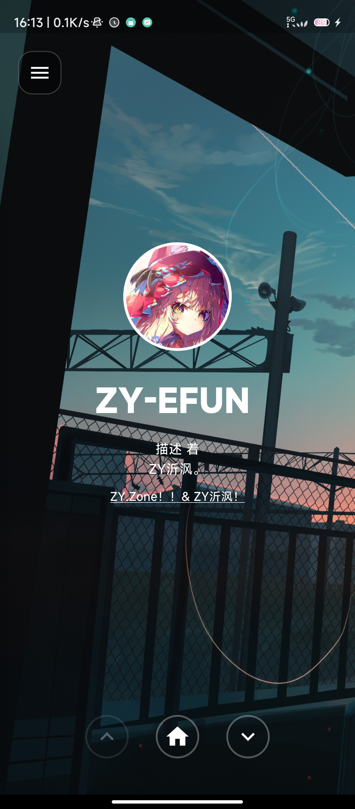
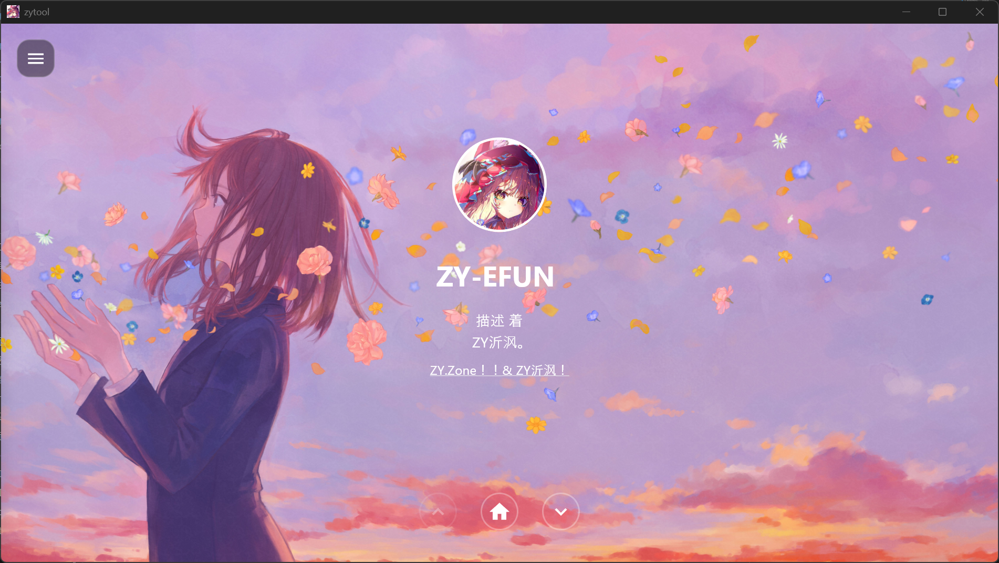

# ZYTool

ZY沂沨的个人工具箱应用，基于 Flutter 开发。

## 预览

### Android 端

| | |
|:---:|:---:|
|  |  |

### PC 端



## 功能特性

### 🎪 欢迎页面
- 个人主页展示
- 背景图片轮播（Ken Burns 动画效果）
- 倒计时动画

### 📤 临时传输
- 文件上传到腾讯云 COS
- 支持多文件同时上传
- 上传进度实时显示
- 上传成功后可复制/跳转分享链接
- 上传失败可复制错误信息
- 显示文件大小和上传时间

### 💡 异想天开（彩蛋页）
- 生日倒计时
- 圆形进度条动画
- 需点击标题 12 次解锁

### 🌏 站点一览
- ZY沂沨的博客和导航站点链接
- 点击跳转到对应网站

### 🍬 关于ZY沂沨
- 个人介绍
- 聊天气泡样式展示

### 📧 联系ZY沂沨
- Email、QQ群、OICQ、Github、Gitee、Blog 等联系方式
- 点击直接跳转

## 项目结构

```
lib/
├── main.dart                    # 入口、全局状态、背景动画、侧边栏
├── models/
│   └── upload_file.dart         # UploadFile、SiteLink 数据类
├── pages/
│   ├── home_page.dart           # 欢迎主页
│   ├── transfer_page.dart       # 临时传输
│   ├── when_page.dart           # 异想天开（彩蛋页）
│   ├── register_page.dart       # 站点一览
│   ├── about_page.dart          # 关于ZY沂沨
│   └── contact_page.dart        # 联系ZY沂沨
├── widgets/
│   ├── page_navigation.dart     # 底部导航按钮
│   ├── chat_message.dart        # 聊天气泡
│   ├── avatar.dart              # 头像组件
│   ├── contact_item.dart        # 联系条目
│   └── file_item.dart           # 文件列表项
└── utils/
    ├── formatters.dart          # 文件大小、日期格式化
    └── url_launcher.dart        # URL跳转工具
```

## 依赖项

- `http` - HTTP 请求
- `url_launcher` - URL 跳转
- `file_picker` - 文件选择
- `cupertino_icons` - iOS 风格图标

## 开发环境

- Flutter SDK: ^3.12.0
- Dart SDK: ^3.12.0

## 运行项目

```bash
# 获取依赖
flutter pub get

# 运行开发模式
flutter run

# 构建 APK
flutter build apk

# 构建 iOS
flutter build ios

# 构建 Web
flutter build web

# 构建 Windows
flutter build windows

# 构建 macOS
flutter build macos

# 构建 Linux
flutter build linux
```

## 应用图标

应用图标使用 `assets/image/headimg_dl.jpg`，可通过以下命令生成：

```bash
flutter pub run flutter_launcher_icons
```

## 资源文件

- `assets/image/` - 背景图片、头像等
- `assets/cursor/` - 自定义光标文件

## 许可证

© 2026 ZY沂沨. All rights reserved.
